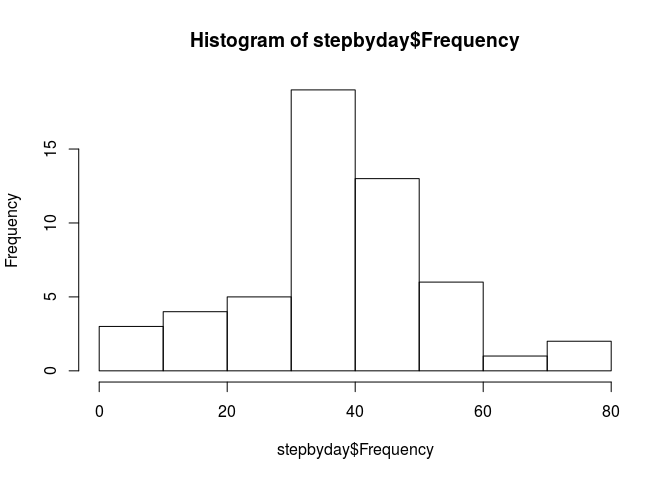
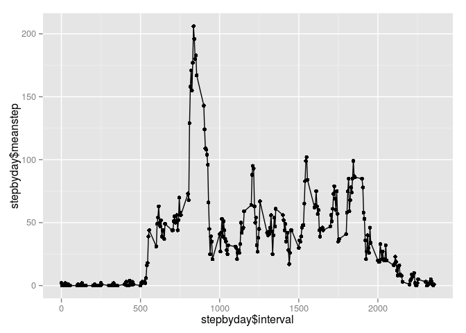
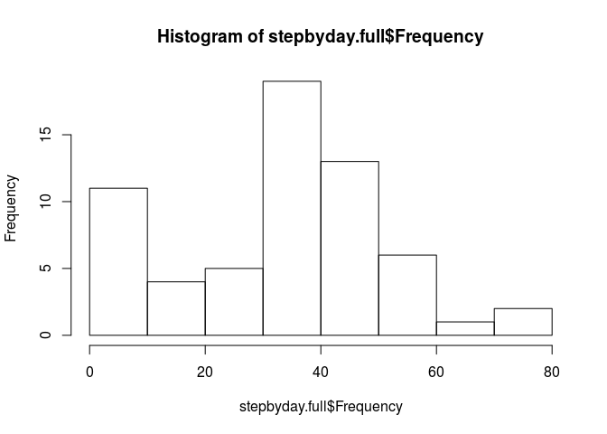
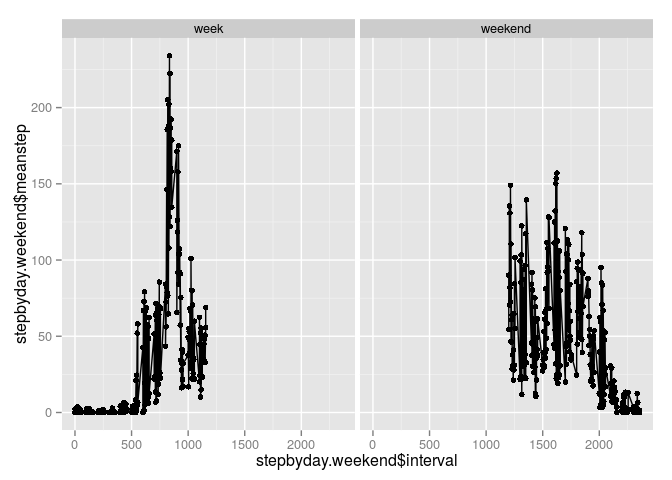

# Reproducible Research: Peer Assessment 1


## Loading and preprocessing the data

Reading input data file and remove NA values:

```r
activity<- read.csv("activity.csv")
activity.nona<-na.omit(activity)
```


## What is mean total number of steps taken per day?


```r
library(dplyr)
```

```
## 
## Attaching package: 'dplyr'
## 
## Następujące obiekty zostały zakryte z 'package:stats':
## 
##     filter, lag
## 
## Następujące obiekty zostały zakryte z 'package:base':
## 
##     intersect, setdiff, setequal, union
```

```r
library(ggplot2)
stepbyday<-as.data.frame(activity.nona %>%group_by(date)%>% summarise(Frequency = mean(steps)))
hist(stepbyday$Frequency)
```

 
  
mean of total steps by day:

```r
mean(stepbyday$Frequency)
```

```
## [1] 37.3826
```
median of total steps by day:

```r
median(stepbyday$Frequency)
```

```
## [1] 37.37847
```
## What is the average daily activity pattern?

Get the average daily activity

```r
stepbyday<-as.data.frame(activity.nona %>%group_by(interval)%>% summarise(meanstep = mean(steps)))
stepbyday[,2]<-as.integer(round((stepbyday[,2]),0))
qplot(stepbyday$interval, stepbyday$meanstep, data = stepbyday)+ geom_line()
```

 
  
Find maximum value of mean step activity

```r
stepbyday[stepbyday$meanstep==max(stepbyday$meanstep),]
```

```
##     interval meanstep
## 104      835      206
```
## Imputing missing values
Total mising values

```r
data.frame(count(activity[is.na(activity$steps),]))
```

```
##      n
## 1 2304
```

replace missing values by median

```r
activity$steps[is.na(activity$steps)] =median(activity$steps, na.rm=TRUE)
```

Create histogram

```r
stepbyday.full<-as.data.frame(activity%>%group_by(date)%>% summarise(Frequency = mean(steps)))
hist(stepbyday.full$Frequency)
```

 
  
mean of total steps by day:

```r
mean(stepbyday.full$Frequency)
```

```
## [1] 32.47996
```
median of total steps by day:

```r
median(stepbyday.full$Frequency)
```

```
## [1] 36.09375
```
  
As we see using median with full dataset is not good idea but is fast to implement...

## Are there differences in activity patterns between weekdays and weekends?

```r
Sys.setlocale("LC_TIME", "en_US.UTF-8")
```

```
## [1] "en_US.UTF-8"
```

```r
activity.nona$day<-weekdays(as.Date(activity.nona$date))
activity.nona[activity.nona$day=="Sunday","weekend"]<-"weekend"
activity.nona[activity.nona$day=="Saturday","weekend"]<-"weekend"
activity.nona[is.na(activity.nona$weekend),"weekend"]<-"week"
 stepbyday.weekend<-as.data.frame(activity.nona %>%group_by(interval,weekend)%>% summarise(meanstep = mean(steps)))
qplot(stepbyday.weekend$interval, stepbyday.weekend$meanstep, data = stepbyday.weekend)+ geom_line()+facet_grid(. ~ weekend)
```

 

